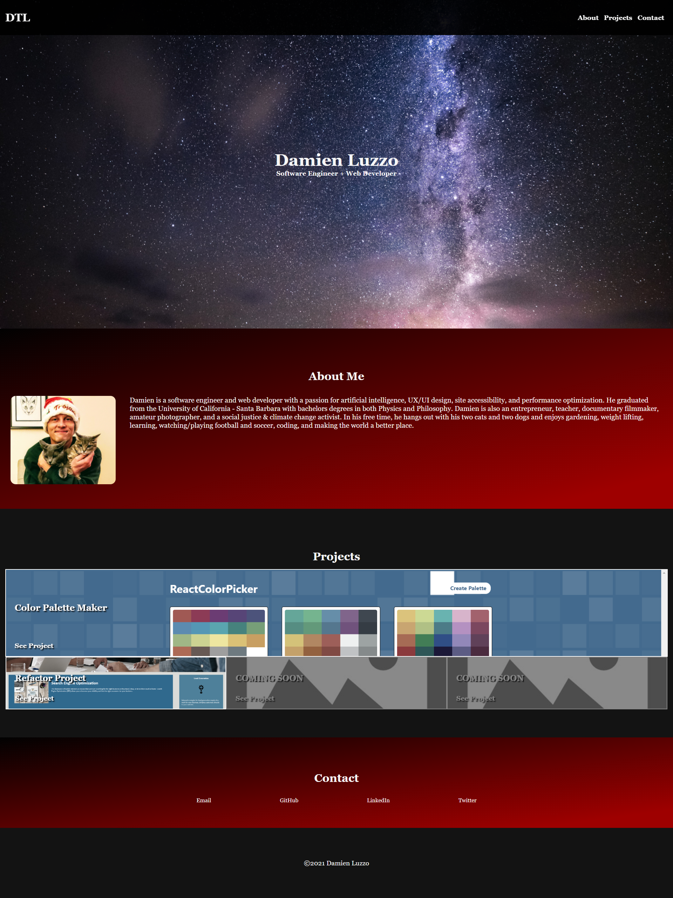

# Damien Luzzo Portfolio Website

## Current Features

+ Personal Photo and About Me

+ Portfolio Projects and Past Work

+ Contact Information

+ Fully Responsive Webpage

## Future Features

+ Add more portfolio projects to projects section

+ Add more responsiveness for users utilizing a wide screen or monitor

+ Add scrolling animation for when the links in the navbar are clicked

+ Add a blog section (and write blog posts for it)

+ Find a better banner image

## Screenshot and Link

[Link To Portfolio On Github Pages](https://damienluzzo33.github.io/homework-2-portfolio-v1/ "Damien's Portfolio - Version 1.0")

## Other

+ Project was done individually, built from scratch, and uses 100% unique code

+ Used GIF in homework README for layout inspiration
