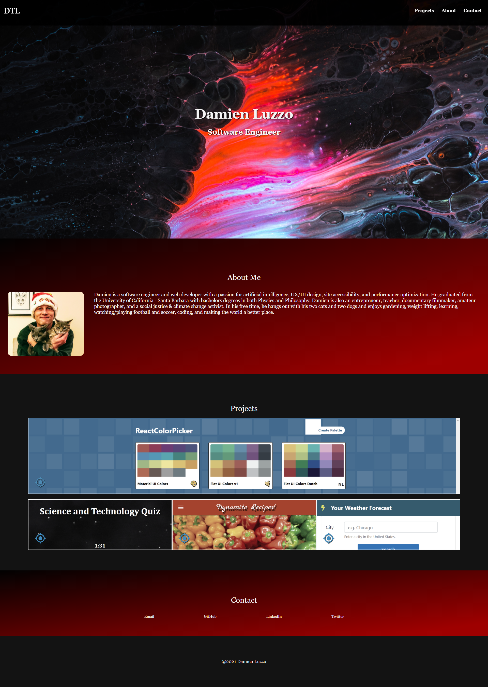
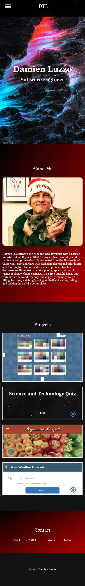

# Damien Luzzo Portfolio Website

Who is Damien Luzzo? Click the link below to find out.
[Damien Luzzo's Awesome Portfolio](https://damienluzzo33.github.io/homework-2-portfolio-v1/ "Damien's Portfolio - Version 1.0")

## Current Features

+ Personal Photo and About Me

+ Portfolio Projects and Past Work

+ Contact Information

+ Fully Responsive Webpage

---

## Future Features

+ Add more responsiveness for users utilizing a wide screen or monitor

+ Add a blog section (and write blog posts for it)

+ ~~Add more portfolio projects to projects section~~

+ ~~Add scrolling animation for when the links in the navbar are clicked~~

+ ~~Find a better banner image~~

---

## Screenshots

### Desktop View

### Mobile View

## Libraries

+ Materialize Navbar
+ Materialize Icons
+ Google Fonts
+ Upsplash Photos